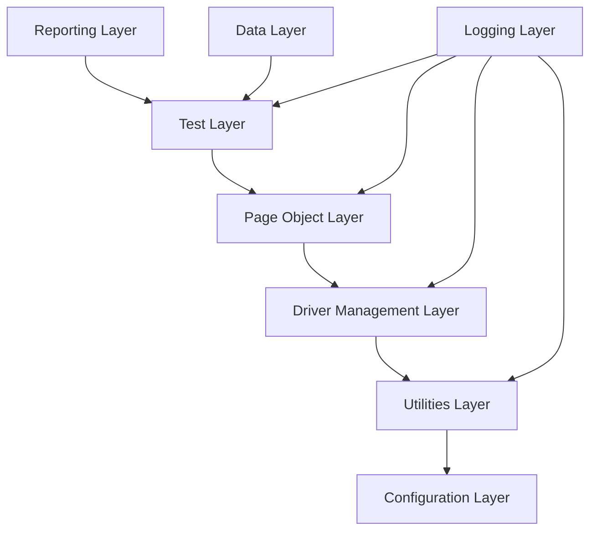

# Design Document

## Overview

The Selenium Test Automation Framework is designed as a comprehensive, modular, and scalable solution for web application testing. The framework follows industry best practices including Page Object Model, Factory Pattern, and Singleton Pattern to ensure maintainability and reusability. It provides a robust foundation that can be easily extended for testing any web application across different browsers and environments.

## Architecture

The framework follows a layered architecture pattern with clear separation of concerns:



### Architecture Layers:

1. **Test Layer**: Contains TestNG test classes and test suites
2. **Page Object Layer**: Implements Page Object Model with PageFactory
3. **Driver Management Layer**: Handles WebDriver lifecycle and browser management
4. **Utilities Layer**: Provides common utilities and helper methods
5. **Configuration Layer**: Manages properties and environment configurations
6. **Reporting Layer**: Handles test reporting and screenshot management
7. **Data Layer**: Manages test data from various sources
8. **Logging Layer**: Provides comprehensive logging capabilities

## Components and Interfaces

### 1. Configuration Management

**ConfigManager Class**

- Singleton pattern for configuration management
- Loads properties from config.properties file
- Supports environment-specific configurations
- Provides methods to retrieve configuration values with defaults

**Properties Structure:**

```properties
# Browser Configuration
browser=chrome
headless=false
browser.timeout.implicit=10
browser.timeout.explicit=20

# Environment Configuration
environment=dev
base.url.dev=https://dev.example.com
base.url.staging=https://staging.example.com
base.url.prod=https://prod.example.com

# Test Configuration
parallel.execution=true
thread.count=3
retry.count=2
```

### 2. Driver Management

**DriverManager Class**

- ThreadLocal WebDriver management for parallel execution
- Factory pattern for browser instantiation
- Automatic driver setup using WebDriverManager
- Browser options configuration (headless, window size, etc.)

**DriverFactory Interface**

```java
public interface DriverFactory {
    WebDriver createDriver(String browserName);
    void setDriverOptions(String browserName);
}
```

### 3. Base Page Object

**BasePage Abstract Class**

- Common page operations (click, type, wait, etc.)
- WebDriverWait utilities with custom conditions
- Screenshot capture functionality
- Element visibility and interaction checks
- PageFactory initialization

**Key Methods:**

- `waitForElement(WebElement element, int timeout)`
- `clickElement(WebElement element)`
- `typeText(WebElement element, String text)`
- `isElementDisplayed(WebElement element)`
- `captureScreenshot(String testName)`

### 4. Test Base Class

**BaseTest Abstract Class**

- TestNG lifecycle management (@BeforeMethod, @AfterMethod)
- WebDriver initialization and cleanup
- Test data setup and teardown
- Screenshot capture on failure
- Retry logic implementation

### 5. Utilities Package

**ExcelUtils Class**

- Read/write Excel files using Apache POI
- Support for .xlsx and .xls formats
- Data provider integration for TestNG

**DatabaseUtils Class**

- JDBC connection management
- Query execution utilities
- Result set processing methods

**APIUtils Class**

- REST API testing using RestAssured
- Request/response validation
- JSON/XML parsing utilities

**WaitUtils Class**

- Custom explicit wait conditions
- Fluent wait implementations
- Element state verification methods

**DataGenerator Class**

- Fake data generation using JavaFaker
- Random test data creation
- Data validation utilities

## Data Models

### 1. Test Configuration Model

```java
public class TestConfig {
    private String browser;
    private boolean headless;
    private String environment;
    private String baseUrl;
    private int implicitTimeout;
    private int explicitTimeout;
    private boolean parallelExecution;
    private int threadCount;
    private int retryCount;
}
```

### 2. Test Result Model

```java
public class TestResult {
    private String testName;
    private String status;
    private String errorMessage;
    private String screenshotPath;
    private long executionTime;
    private String browser;
    private String environment;
}
```

### 3. Page Element Model

```java
public class PageElement {
    private By locator;
    private String elementName;
    private int timeout;
    private boolean required;
}
```

## Error Handling

### 1. Custom Exceptions

**FrameworkException**

- Base exception class for framework-specific errors
- Includes error codes and detailed messages
- Supports exception chaining

**ElementNotFoundException**

- Thrown when elements cannot be located
- Includes locator information and timeout details

**ConfigurationException**

- Thrown for configuration-related errors
- Includes property name and expected format

### 2. Retry Mechanism

**TestRetryAnalyzer**

- Implements IRetryAnalyzer interface
- Configurable retry count
- Logs retry attempts
- Excludes specific exception types from retry

### 3. Error Reporting

**ErrorReporter Class**

- Captures detailed error information
- Takes screenshots on failures
- Logs stack traces with context
- Integrates with reporting framework

## Testing Strategy

### 1. Unit Testing

**Framework Components Testing**

- ConfigManager functionality
- DriverManager browser initialization
- Utility classes methods
- Custom wait conditions

**Test Coverage:**

- Configuration loading and validation
- WebDriver creation and management
- Page object initialization
- Utility method functionality

### 2. Integration Testing

**Cross-Browser Testing**

- Chrome, Firefox, Edge, Safari support
- Headless mode validation
- Mobile browser testing (Chrome Mobile, Safari Mobile)

**Environment Testing**

- Dev, staging, production environment switching
- Configuration override testing
- URL routing validation

### 3. Performance Testing

**Framework Performance**

- WebDriver initialization time
- Page load performance monitoring
- Memory usage optimization
- Parallel execution efficiency

### 4. Test Data Management

**Data-Driven Testing**

- Excel file integration with TestNG DataProvider
- CSV file support for simple datasets
- JSON configuration for complex test scenarios
- Database integration for dynamic data

### 5. Reporting and Monitoring

**ExtentReports Integration**

- Detailed HTML reports with screenshots
- Test execution timeline
- Browser and environment information
- Pass/fail statistics and trends

**Allure Reporting**

- Advanced reporting with step-by-step execution
- Attachment support for screenshots and logs
- Historical trend analysis
- Integration with CI/CD pipelines

## Project Structure

```
selenium-test-framework/
├── src/
│   ├── main/
│   │   └── java/
│   │       └── com/
│   │           └── framework/
│   │               ├── config/
│   │               │   ├── ConfigManager.java
│   │               │   └── TestConfig.java
│   │               ├── driver/
│   │               │   ├── DriverManager.java
│   │               │   ├── DriverFactory.java
│   │               │   └── BrowserType.java
│   │               ├── pages/
│   │               │   └── BasePage.java
│   │               ├── utils/
│   │               │   ├── ExcelUtils.java
│   │               │   ├── DatabaseUtils.java
│   │               │   ├── APIUtils.java
│   │               │   ├── WaitUtils.java
│   │               │   └── DataGenerator.java
│   │               ├── exceptions/
│   │               │   ├── FrameworkException.java
│   │               │   └── ElementNotFoundException.java
│   │               └── reporting/
│   │                   ├── ExtentManager.java
│   │                   └── TestListener.java
│   └── test/
│       ├── java/
│       │   └── com/
│       │       └── tests/
│       │           ├── BaseTest.java
│       │           └── sample/
│       │               └── SampleTest.java
│       └── resources/
│           ├── config.properties
│           ├── testng.xml
│           └── testdata/
│               └── testdata.xlsx
├── pom.xml
├── README.md
└── .gitignore
```

## Technology Stack

**Core Technologies:**

- Java 11+
- Selenium WebDriver 4.x
- TestNG 7.x
- Maven 3.x

**Additional Libraries:**

- WebDriverManager (automatic driver management)
- ExtentReports (reporting)
- Apache POI (Excel operations)
- RestAssured (API testing)
- JavaFaker (test data generation)
- Log4j2 (logging)
- Jackson (JSON processing)

**Build and CI/CD:**

- Maven Surefire Plugin
- Maven Compiler Plugin
- Allure Maven Plugin
- Jenkins/GitHub Actions integration
